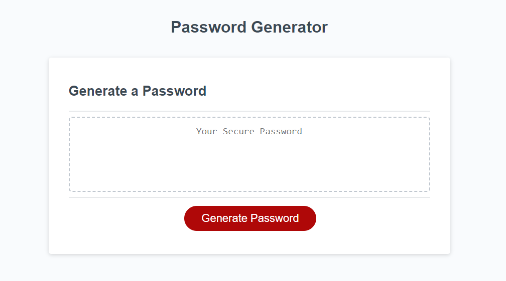
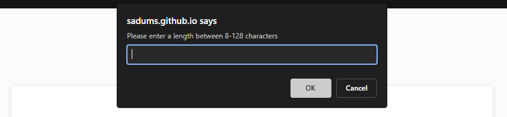
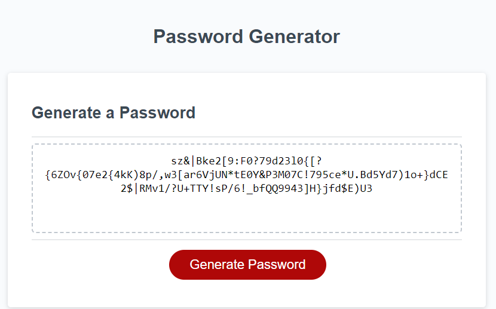

# Password Generator

## Description

I built this project to learn more of javascript syntax and basic principles. I also wanted to try out the confirm, prompt, and alert functions. This project can help anyone who needs a quick password generated. I learned how to organize my code and prepare for future coding problems before they happen.

## Installation

N/A

## Usage

Press "Generate Password" button.

Answer prompts for password criteria

Copy password from textbox

https://sadums.github.io/Password-Generator/

## License

Refer to license in the repository.